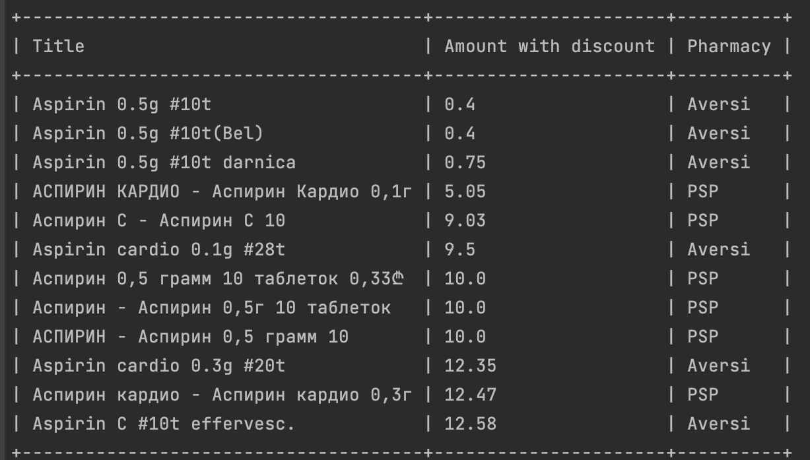

# pharmacy_parcer
parser for Georgian pharmacies Psp & Aversi

## Installation

Clone the project 

To install the required dependencies, run:
bundle install

uses Google translate api, so you need to get a Api key
and put it into .env file

## Usage example
ruby index.rb aspirin

## Answer example:

